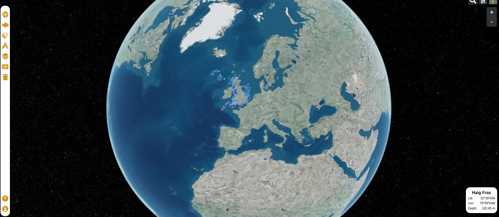

# 3D Map

## Introduction

Our 3D map version is built upon the [Resium](https://resium.reearth.io/) library, which is essentially Cesium for React. This powerful library serves as the foundation for creating interactive and immersive 3D geospatial experiences within our application. In this documentation, we'll explore the details of our 3D map implementation, interactions with the map, and essential observations for development and production use.



*The image above provides an overview of our 3D map utilizing Resium.*

## Map Interaction

Interacting with the 3D map is a critical aspect of our geospatial application. To enable map interaction, we define a 'ref' prop within the Resium Viewer component. This 'ref' prop is passed a useRef created within the 3D Map component. This approach provides a means for managing and interacting with the 3D map.

Similar to the 2D map, layers added to the 3D map are assigned a unique 'attribution' value. This value is vital for identifying and interacting with specific layers on the map. When an operation or interaction with a layer is required, the map seeks the layer with the corresponding attribution value, allowing for seamless interaction.

It's essential to note that the Cesium library handles layers differently from Leaflet. In Cesium, each type of layer is treated as a separate component. Furthermore, some layers in Cesium are not easily modifiable. This has led to the decision to remove and re-add layers in many cases to ensure they function as intended.

## Important Observations

While developing with React, it's important to be aware of a characteristic where React renders all components on the page twice. This behavior is a valuable feature for development testing but can present challenges when working with Resium. In practice, React renders two 3D maps, with only the second map being interactive. To address this and ensure that you can effectively test and use the map during development, follow these steps:

- Remove the 'full' prop from the Viewer component.
- Add the following information to the 'styles.ts' file of the 3D map component:

```jsx
export const ResiumContainer = styled.div`
  /* div:first-child {
    div:first-child {
      height: 500px;
    }
  } */
`
```

These adjustments should be removed when deploying the application for production use.

## Additional Note

It's worth mentioning that we have also implemented an example map using MapBox3D. However, it is not currently in production and serves as a separate experimental component.

Our 3D map implementation opens up new possibilities for immersive geospatial experiences, and we are committed to continually enhancing its functionality.

If you have any questions or need further information regarding our 3D map implementation, please consult the project repository or reach out to our support team for assistance.