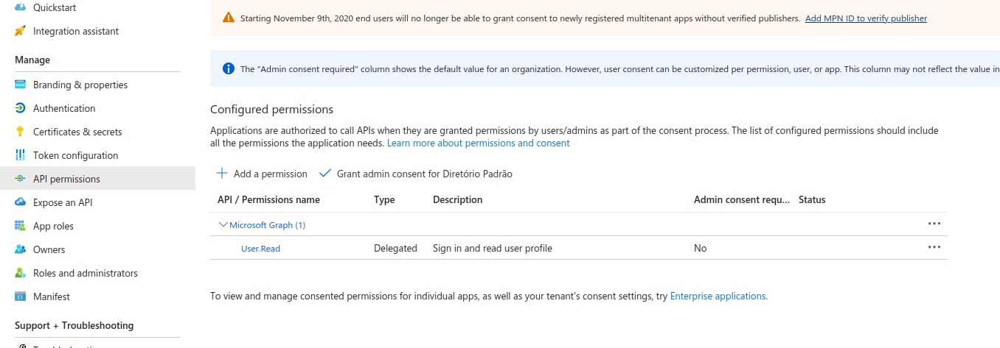
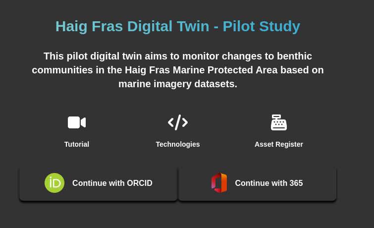

# Authentication

Our application supports two methods of authentication: using ORCID and Microsoft 365. In both cases, the application functions as follows:

## Creating Applications on the Platforms

To use these authentication methods, you need to register your application with the respective platforms.

### ORCID

1. Log in to your ORCID account and visit the following link: [ORCID Developer Tools](https://orcid.org/developer-tools).
2. Follow the steps outlined in this guide: [Registering a Public API Client](https://info.orcid.org/documentation/integration-guide/registering-a-public-api-client).
3. After registering your application, you should update the following information in the .env file of the frontend project:

```env
VITE_ORCID_CLIENT_ID=
VITE_ORCID_CLIENT_SECRET=
```

4. These details should also be updated in the backend application:

```env
VITE_ORCID_CLIENT_ID=
VITE_ORCID_CLIENT_SECRET=
VITE_ORCID_CLIENT_REDIRECT_URI=
```

### Microsoft 365

1. For Microsoft 365, start by creating an account on Azure Cloud through this link: [Azure Portal](https://portal.azure.com).
2. If you create the account using your professional email, you will need to contact the Help Desk to request authorization for application creation.
3. Once your account is created, register your application here: [Azure App Registrations](https://portal.azure.com/#view/Microsoft_AAD_RegisteredApps/ApplicationsListBlade).
4. Click "New registration" and provide the necessary information about your application.
5. Next, click on "API Permissions" and add a new permission, as illustrated in the image below:



6. Afterward, navigate to "Certificates and Secrets" and generate a new secret. Update the .env file as follows:

```env
VITE_365_CLIENT_ID=
VITE_365_TENANCY_ID=
VITE_365_REDIRECT_URI=
```

7. These details should also be updated in the backend application.

## Authentication Process

The application's authentication process follows these steps:

1. Upon loading, the application checks for the presence of a 'token' cookie. This cookie contains a JWT (JSON Web Token) with user information.
2. The token is sent to the backend, which converts it into a JSON format and verifies if the user exists and has the necessary authorization to access the application.
3. This check is performed using a list of registered emails and ORCID IDs available in the backend.
4. If the user is found and authorized, this information is sent to the frontend, granting access to the system. The 'src/lib/auth.ts' file handles this verification.

If the user doesn't exist or if there is no 'token' cookie, users are directed to the login page:



The login system connects with the applications created in ORCID and Microsoft 365 to obtain a single-use 'code'. This code provides access to the APIs of these applications and allows retrieval of user information.

The single-use code is sent by the authenticators to the '/auth' route, which forwards it to the backend. Within the backend, communication with the ORCID and Microsoft 365 systems occurs to fetch user data.

Finally, the backend returns a JWT token to the frontend, which is saved as a cookie. Note that the cookie has an expiration time set.