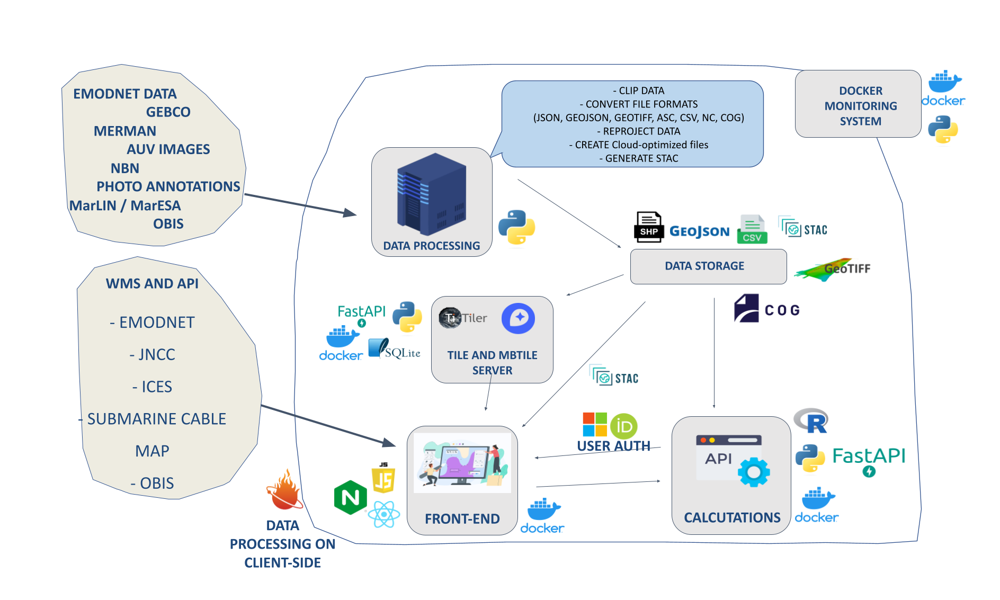

# Home

The Haig Fras Digital Twin project aims to establish a system representing a Digital Twin for the Haig Fras environmental protection area in the Celtic Sea.

## General Project Infrastructure

This project is based on a web-client that accesses data from different locations and uses various microservices related to APIs and tile servers. Below, we will describe the project's infrastructure in more detail.

As shown in the figure above, both the frontend and all microservices are running in Docker containers. These Docker containers are stored in a container registry. Currently, we are using the container registry of BODC, based on Nexus, and the Oracle Cloud. The containers are updated each time a push is made to the master repository of the container.

The final versions of the docker containers are available below:

- Frontend: docker-repo.bodc.me/oceaninfo/imfe-pilot/frontend:v1.0
- API: docker-repo.bodc.me/oceaninfo/imfe-pilot/api_calculations_use_cases_web:v1.0
- Tileserver: docker-repo.bodc.me/oceaninfo/imfe-pilot/tileserver:v1.0
- MBTiles Server: docker-repo.bodc.me/oceaninfo/imfe-pilot/mbtiles:v1.0
- Docker monitor: docker-repo.bodc.me/oceaninfo/imfe-pilot/monitor_docker:v1.0

## Prototype

Before the start of the project, a prototype of the system was developed to understand the user journey throughout the application usage. This prototype was developed using FIGMA, which was essential for understanding many of the features that would later be integrated and for facilitating the platform's styling programming.

The final version of the FIGMA prototype can be accessed [here](https://www.figma.com/file/LylND8kGXCXjJ2dMejdA9w/IMFE-PILOT?type=design&node-id=1%3A2&mode=design&t=jrJU4IAJ7EWn5Xf2-1).

## Repositories

These are the project repositories:

- [bodc-code](https://gitlab.com/nocacuk/ocean-informatics/imfepilot/bodc-code): `!WARNING: PRIVATE PROJECT` This was the initial repository of the project when it was conceived. It contains the early drafts of the code used in the project. Additionally, it still holds a significant portion of the documentation related to data format conversion.

- [Data Pipelines](https://github.com/NOC-OI/data_pipelines): This repository contains all the code for data format conversion, data uploading to the Object Store, and STAC Catalog creation.

- [frontend](https://github.com/NOC-OI/imfe-pilot-frontend): A frontend application created in React, with the ability to interact with different data formats on both the backend and frontend. This project depends on certain backend services to perform tile server activities, as well as authentication and data calculations.

- [tileserver](https://github.com/NOC-OI/imfe-pilot-tileserver): Repository for configuring and creating tile servers.

- [monitor_docker](https://github.com/NOC-OI/monitor_docker): A Python package for monitoring container operation on the server.

- [frontend_test](https://github.com/NOC-OI/imfe-pilot-frontend_tests): Repository containing Selenium tests for the frontend.

- [salt_config](https://github.com/NOC-OI/imfe-pilot-salt_config): Repository contaning the Salt configuration for the VM.

## Server Instance Organization

The organization of server instances is carried out through the [salt_config](https://github.com/NOC-OI/imfe-pilot-salt_config) repository. This repository is based on the configuration of server stacks in the [Salt project](https://saltproject.io/). More information about the use and configuration of Salt can be found in the [Salt repository in this project](https://github.com/NOC-OI/imfe-pilot-salt_config).

## Deploying the Project

To deploy the project, follow the procedures [described here](deploy.md).

## CI/CD Pipeline

This repository includes an automatic GitLab CI/CD pipeline for continuous integration and continuous deployment. More information about this pipeline can be found in the [CI/CD Pipeline documentation](cicd.md).

## Data Organization: Object Store and STAC Catalog

All project data files are stored in an object store. In this case, the files are accessed via HTTP requests, without the need for an intermediate database or an API.

As the object store appears as a group of files, it is necessary to create a catalog of these files, called an [STAC Catalog](https://stacspec.org/en). The STAC catalog for this project can be accessed [here](https://radiantearth.github.io/stac-browser/#/external/pilot-imfe-o.s3-ext.jc.rl.ac.uk/haig-fras/stac/catalog.json). For more information on how to generate the STAC Catalog, refer to the [Data Pipelines repository](https://github.com/NOC-OI/data_pipelines).

This project suggests an organization of files in the Object Store, as [described here](object_store.md).

If you want to understand a little bit more about how we deal with STAC Catalogs, please [click here](stac.md).

## Data Format Conversion

In this project, data from different formats is converted into formats optimized for the cloud. Data conversion is performed through a series of Python codes that convert data from the following formats: GeoTIFF, GeoJSON, Shapefile, FlatGeoBuf, COG, Zarr, NetCDF, among others.

The codes for converting data are described in the [Data Pipelines repository](https://github.com/NOC-OI/data_pipelines).

More information about all the data types that we have been working with are described below:

- [Cloud Optimized GeoTIFF](cog.md)

- [MBTiles](mbtiles.md)

- [WMS Layers](wms.md)

- [Cesium Ion](cesium_ion.md)

- [CSV - Organisms Annotation](photos.md)

## Authentication

To control access to the project's frontend, two types of authentication have been implemented: ORCID and Microsoft 365. More information can be found [here](authentication.md).

## Frontend Application

The frontend application was developed in React and is converted into a Docker container. This app is currently running on Jasmin and Oracle Cloud and can be accessed via the links [https://imfe-pilot.noc.ac.uk](https://imfe-pilot.noc.ac.uk) and [https://haigfras-salt.co.uk](https://haigfras-salt.co.uk).

You can find a detailed explanation about all the frontend features [here](frontend.md).

More information about the frontend application can be found in the repository: [https://github.com/NOC-OI/imfe-pilot-frontend](https://github.com/NOC-OI/imfe-pilot-frontend)

## Backend Application

Although the frontend application does not necessarily require a backend to perform most of its activities, a backend was still implemented in the project. The backend is used for the following activities:

- Server-side calculations for the Digital Twin for Haig Fras project.
- Management and access to the user table, enabling authentication.

This app is currently running on Jasmin and Oracle Cloud and can be accessed via the links [https://imfe-pilot-api.noc.ac.uk](https://imfe-pilot-api.noc.ac.uk/) and [https://haigfras-salt-api.co.uk](https://haigfras-salt-api.co.uk/).

More information about the backend application can be found in the [repository](https://github.com/NOC-OI/imfe-pilot-api) or in this [link](backend.md).

## Tile Servers

Some data formats require the use of tile servers to optimize data rendering on the frontend. For this project, the following servers are used:

1) Titiler: FastAPI application for dynamic tiling. It is used for COG files. You can see more information [here](cog.md).
2) MBTiles: a Python server for organizing mbtiles files from object stores. You can see more information [here](mbtiles.md).

The tile servers are converted into Docker containers. More information about the servers can be found in the repository: [https://github.com/NOC-OI/imfe-pilot-frontend_tests](https://github.com/NOC-OI/imfe-pilot-tileserver).

## Application Tests

A repository was created with the aim of conducting integration tests for the project. With these tests, it is possible to assess whether any changes to the frontend or any of the microservices will or will not impact the project as a whole.

Further information can be found in the project repository: [https://github.com/NOC-OI/imfe-pilot-frontend_tests](https://github.com/NOC-OI/imfe-pilot-frontend_tests).

## Container Monitoring

To monitor the availability of the frontend application, as well as the microservices, a package has been implemented with the objective to monitor the operation of Docker containers on a virtual machine (VM). This package operates as follows:

- At certain time intervals, the VM will run a script that saves a CSV file with the status of all containers (including those already finished).
- A set of commands within a Docker container, also on the VM, will evaluate this file. If there are any changes in the status of the containers or if they are not functioning properly, an email group will be notified.
- If any container encounters an issue, an email will be sent with the subject "Issues with container(s): {container-names}".
- If the situation returns to normal, an email with the subject "Containers OK!" will be sent, indicating that all containers are now working correctly.

More information about this task can be found in the repository: [https://github.com/NOC-OI/monitor_docker](https://github.com/NOC-OI/monitor_docker).
