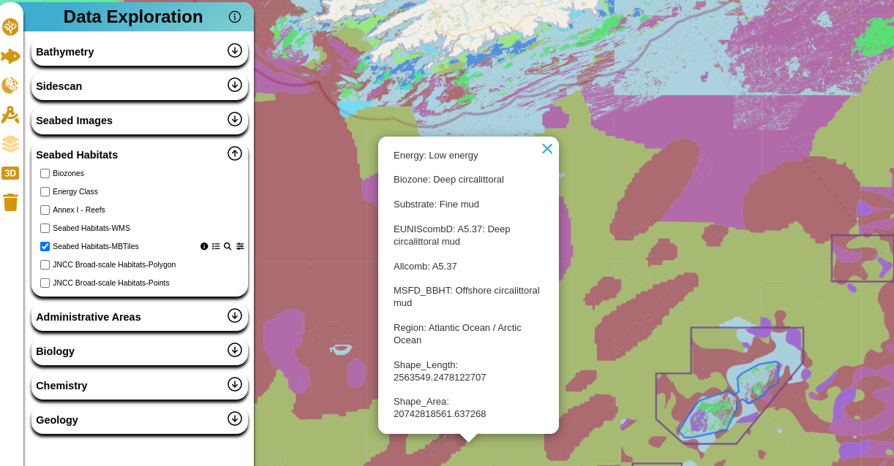

# MBTiles

## Introduction

MBTiles are files used to store vector data in the form of an SQLite database. In our project, we utilize MBTiles as a critical component for efficiently managing and rendering vector data. This documentation explains how MBTiles are used in our system and provides insights into the processes and infrastructure that support them.

## MBTiles File Format

MBTiles serve as the fundamental data format for storing vector information. They are employed to manage spatial data in a compact and organized manner. These files essentially consist of SQLite databases optimized for spatial queries.

## Server for Handling MBTiles

To access and process MBTiles files, we've developed a Python-based service. This service is responsible for executing queries on the database and returning the specific data required for rendering on the frontend. It plays a pivotal role in ensuring that only relevant map data is retrieved and displayed on the map, optimizing both performance and resource utilization.

Our MBTiles server is based on the [mbtiles-s3-server](https://github.com/uktrade/mbtiles-s3-server) library, which provides efficient and scalable methods for serving MBTiles data. This service is currently in production and can be accessed through the following links:

- [https://imfe-pilot-mbtiles.noc.ac.uk.net/](https://imfe-pilot-mbtiles.noc.ac.uk.net/)
- [https://haigfras-salt-mbtiles.co.uk/](https://haigfras-salt-mbtiles.co.uk/)

## Project Repository

The codebase for our MBTiles service is hosted on GitLab, and you can access the repository at [https://github.com/NOC-OI/imfe-pilot-tileserver](https://github.com/NOC-OI/imfe-pilot-tileserver). This repository contains the source code, documentation, and configurations related to our MBTiles server.

## Generating MBTiles Data

For this project, we are using the output of the EUSeaMap 2021 large-scale predictive model produced by EMODnet Seabed Habitats. The data was extracted from [here](http://gis.ices.dk/geonetwork/srv/eng/catalog.search#/metadata/10d3d35c-8f8e-40ff-898f-32e0b037356c) in Geodatabase format. It was converted to GeoJSON format using the [GDAL library](https://gdal.org/). Finally, the GeoJSON file was converted to MBTiles format, representing an SQLite database, using the [tippecanoe library](https://github.com/mapbox/tippecanoe). The conversion utilized the "—drop-densest-as-needed" option.

Detailed steps for file conversion are described in the [repository](https://github.com/NOC-OI/imfe-pilot-tileserver).

## Map Visualization

To provide a visual overview, here's an example of a 2D map rendering using MBTiles data:

*The above image illustrates a 2D map visualization using MBTiles data.*

## Limitations in 3D Mapping

It's important to note that due to certain limitations imposed by the Cesium library, opening MBTiles files in 3D maps is not currently supported. Our project primarily focuses on optimizing 2D map rendering, and we are actively exploring solutions to extend this functionality to 3D mapping in the future.
