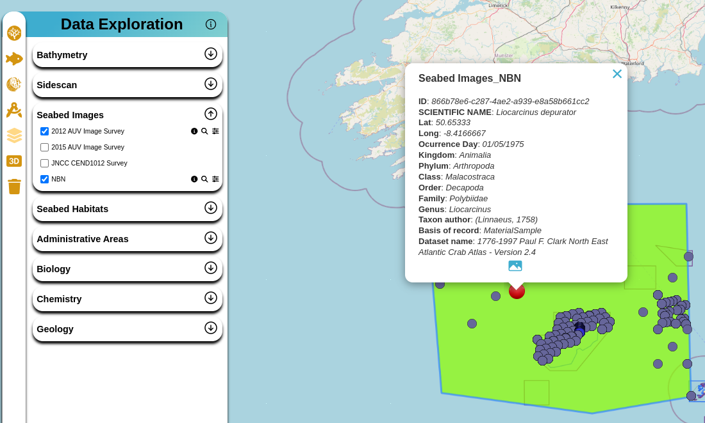
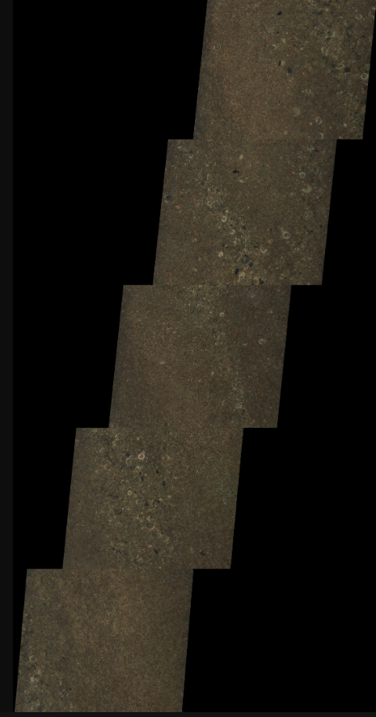

# CSV - Organisms Annotations

In this project, we are working directly with data related to underwater photographs and annotations of marine organism occurrences. There is no standard for organizing this type of data and presenting it on a website. Currently, in this project, we are working with the following data sources:

- NOC Haig Fras 2012 autonomous underwater vehicle image survey
- NOC Haig Fras 2015 autonomous underwater vehicle image survey
- JNCC CEND2012 Survey
- National Biodiversity Network (NBN) Gateway

The files were obtained from different sources in different formats. The following steps and data organization strategies will be described:

## Initial Format

Regarding the two NOC campaigns, the purpose was to capture seafloor images. These images underwent internal processing and organization and were converted to JPG files. In some cases, the images were also converted and georeferenced to GeoTIFF format. Along with the images, a CSV file with annotations related to organism observations and counts was also provided.

For the JNCC campaign, images in JPG format and a list with the positions and occurrences of organisms were provided.

For the NBN Atlas, data were extracted from [https://nbnatlas.org](https://nbnatlas.org). The NBN Atlas data were filtered by drawing a bounding box in the region of the Greater Haig Fras Marine Protected Area (MPA). Datasets without the CC-BY or CC-BY-NC license were removed. Datasets related to bird and planktonic surveys were individually excluded from the search.

## Format Conversion

All CSV files were converted to GeoJSON and saved in the Object Store to facilitate plotting and data work on the frontend. For GeoTIFF images, they were converted to the COG format, also with the goal of accelerating rendering on the frontend.

It should be noted that for NBN data, this download was subsequently passed through the [World Register of Marine Species (WoRMS) Taxon Matching tool](https://www.marinespecies.org/aphia.php?p=match), and the output was manually filtered to further restrict the output to contain only plants and invertebrate animals, excluding plankton.

It should be noted that the CSV files, GeoJSON, JPG, and COG images were described in the [STAC Catalog of these images](https://radiantearth.github.io/stac-browser/#/external/pilot-imfe-o.s3-ext.jc.rl.ac.uk/haig-fras/stac/Seabed%20Images/catalog.json).

## Presentation on the Frontend

For presenting the data on maps, the frontend fetches the GeoJSON files, which contain all the necessary information for plotting on the maps.

*Example of how photos are arranged and presented in the frontend application*

*Example of one of the underwater images*